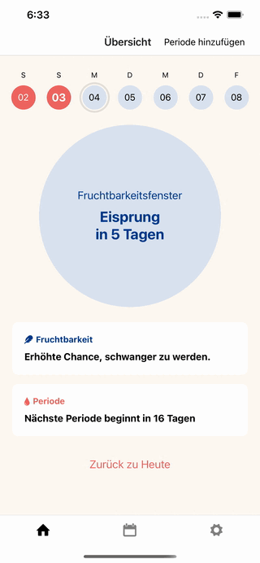

<br />
<p align="center">
  <a href="https://github.com/mrzmyr/palila-app">
    
  </a>

  <h3 align="center">Palila App</h3>

  <p align="center">
    Period Tracking App which lets you track your period and symptoms.
    <br />
    <a href="https://github.com/mrzmyr/palila-app/issues">Report Bug</a>
    ·
    <a href="https://github.com/mrzmyr/palila-app/issues">Request Feature</a>
  </p>
</p>

## About The Project

<p align="center">
  
</p>

This app was written to learn the characteristics of the menstrual cycle and design possible algorithms to help keep track of it.

The key questions this app aims to answer are:

- When is my next menstruation?
- What is the chance of getting pregnant right now?

The app offers even more **featueres**:

- Data is stored locally (not in the cloud).
- Export and import data
- Cycle length estimation
- Period length estimation
- Symptom tracking
- Prediction of next 3 periods
- Predictions of PMS

**Sitemap**

- Home
- Calendar
- Calendar Help
- Settings
- Tracking
- Introduction

**Tracking**

- Period
  - Light
  - Medium
  - Strong
  - Spotting
- Emotion
  - Emotion
  - Happy
  - Sad
  - Sensitive
  - PMS
- Intercourse
  - Unprotected
  - Protected
  - High Sex Drive
  - Masturbation
- Pain
  - Cramps
  - Headache
  - Breast Tenderness
  - Bloating

**Design**

https://www.figma.com/file/fqHoiqCQIPdG0kMGhGFwHy/Palila-App?node-id=0%3A1

**Feature Comparison**

https://y99.notion.site/5c32d3b258fc41f5b65403e94d3ebf65?v=ed163c764f7b4e268f935194a15c44a0

A list of commonly used resources that I find helpful are listed in the acknowledgements.

### Built With

This section should list any major frameworks that you built your project using. Leave any add-ons/plugins for the acknowledgements section. Here are a few examples.

* [React Native](https://reactnative.dev/)
* [Expo](https://expo.dev/)

### Development

1. Clone the repo
   ```sh
   git clone https://github.com/mrzmyr/palila-app.git
   ```
2. Install dependencies
   ```JS
   yarn
   ```
3. Start local server

- iOS: iOS Simulator / iOS Phone required
```JS
   yarn run ios
   ```

- Android: Android Emulator / Android Phone required
```JS
   yarn run android
   ```

## Roadmap

Possible future plans could do:

- [ ] Refactor Algorithmns (and document)
- [ ] Rebuild calendar (own components)
- [ ] Fix bug which happens when tracking periods with 3+ days in specific cases
- [ ] Integration of the [introduction screens](screens/IntroScreen.tsx)
- [ ] Lock Orientation: https://docs.expo.io/versions/latest/sdk/screen-orientation/
- [ ] Publish App ([iOS](https://developer.apple.com/app-store/review/#common-app-rejections), Android)

See the [open issues](https://github.com/mrzmyr/palila-app/issues) for a list of proposed features (and known issues).

## Contributing

Contributions are what make the open source community such an amazing place to learn, inspire, and create. Any contributions you make are **greatly appreciated**.

1. Fork the Project
2. Create your Feature Branch (`git checkout -b feature/AmazingFeature`)
3. Commit your Changes (`git commit -m 'Add some AmazingFeature'`)
4. Push to the Branch (`git push origin feature/AmazingFeature`)
5. Open a Pull Request

## Contact

mrzmyr [@mrzmyr](https://twitter.com/mrzmyr)

Project Link: [https://github.com/mrzmyr/palila-app](https://github.com/mrzmyr/palila-app)
